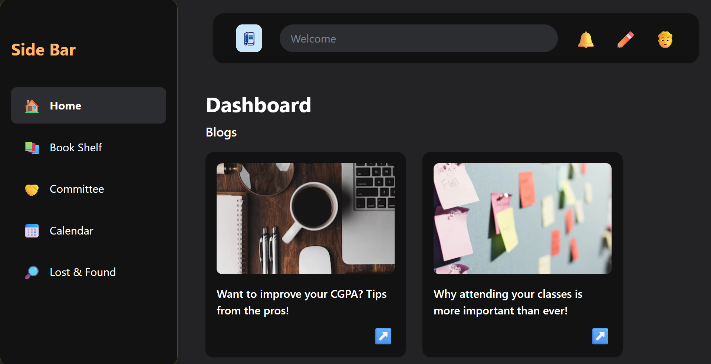
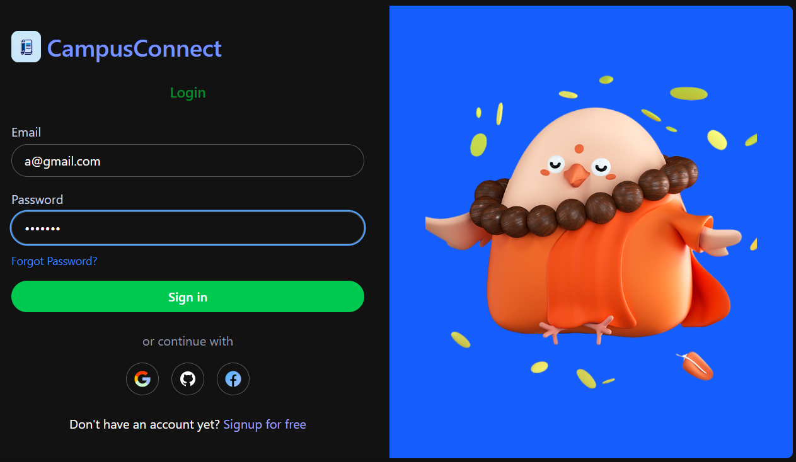
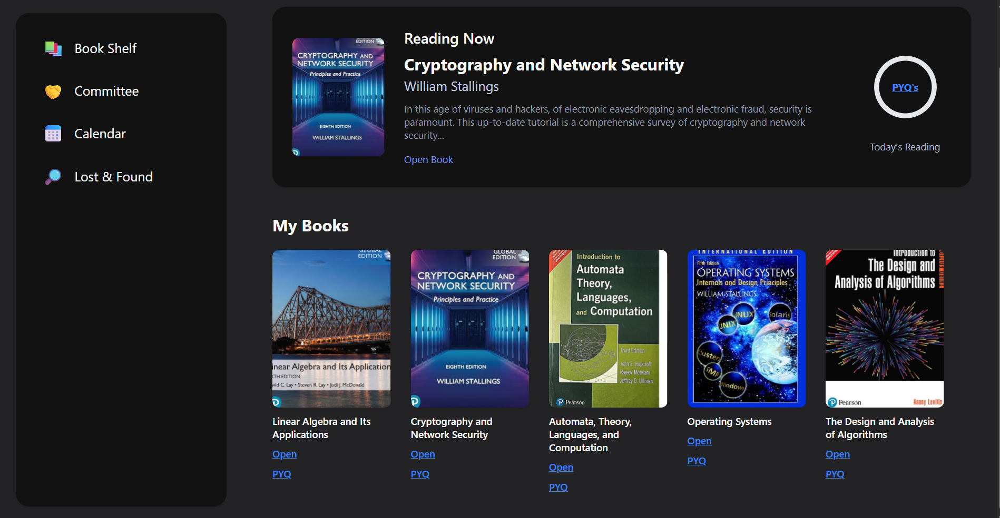
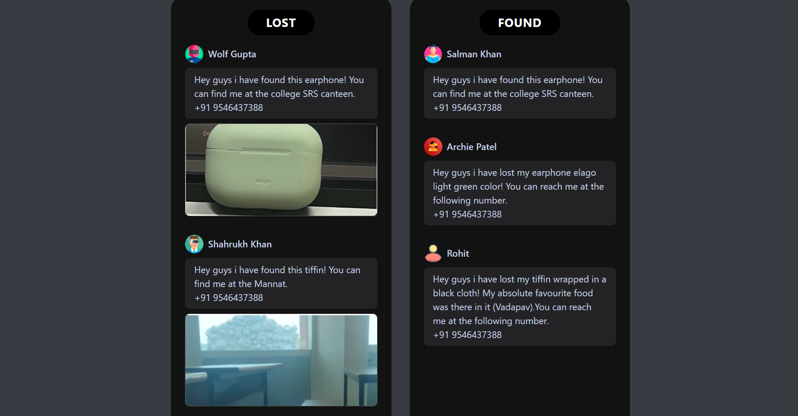

# Campus-Connect

A modern, full-stack **student campus portal** designed to digitize and streamline campus interactions between students, faculty, and administration. The platform provides a centralized hub for academic resources, campus announcements, event management, lost & found services, and digital book management - all wrapped in an intuitive, responsive interface.

**Campus Connect** eliminates traditional paper-based processes by offering digital solutions for campus communication, resource sharing, and student services. Students can access academic materials, track campus events, report lost items, and stay connected with campus life through a unified dashboard.

**Technology Stack:**
- **Frontend:** React.js with React Router, Tailwind CSS, Axios
- **Backend:** Node.js, Express.js 
- **Database:** MongoDB with Mongoose ODM
- **Authentication:** JWT (JSON Web Tokens), Zod validation
- **Cloud Database:** MongoDB Atlas
- **Additional:** CORS, bcrypt (for production password hashing)

---

## Features

### 🏠 Dashboard & Navigation
- Clean, modern sidebar navigation with intuitive icons
- Responsive design with Tailwind CSS
- Blog section with campus updates and academic tips
- Real-time welcome interface

### 📚 Digital Book Shelf
- Academic resource library featuring textbooks
- Categories: Linear Algebra, Cryptography, Operating Systems, Algorithm Design
- "Reading Now" functionality with progress tracking
- Quick access links to digital books and PYQ (Previous Year Questions)

### 🔍 Lost & Found Portal
- Community-driven lost and found system
- Image upload support for found items
- Contact information exchange between users
- Separate "LOST" and "FOUND" sections for easy navigation

### 🔐 Secure Authentication
- JWT-based authentication system
- Email validation and password strength requirements
- Social login options (Google, GitHub, Facebook)
- Secure user registration and login flows

### 📅 Campus Management
- Committee information and event management
- Calendar integration for academic schedules
- Campus-wide announcement system

---

## Screenshots

### 1. Dashboard

*Main dashboard featuring blog posts, navigation sidebar, and campus updates*

### 2. Authentication

*Secure login with social authentication options and modern UI design*

### 3. Digital Library

*Academic resource library with reading progress and quick access features*

### 4. Lost & Found

*Community portal for lost and found items with image upload capability*

---

## Installation & Setup

### Prerequisites
- Node.js (v14 or higher)
- MongoDB Atlas account
- Git

### Backend Setup

Clone the repository
git clone [https://github.com/Ath007-dev/campus-connect.git](https://github.com/Ath007-dev/CampusConnect)

Install dependencies
npm install

Create .env file with:
MONGODB_URI=your_mongodb_atlas_connection_string
JWT_SECRET=your_jwt_secret_key
cd src/backend
node user.js

### Frontend Setup
cd ..

Install dependencies
npm install

Start the React app
npm start

App runs on http://localhost:3000
